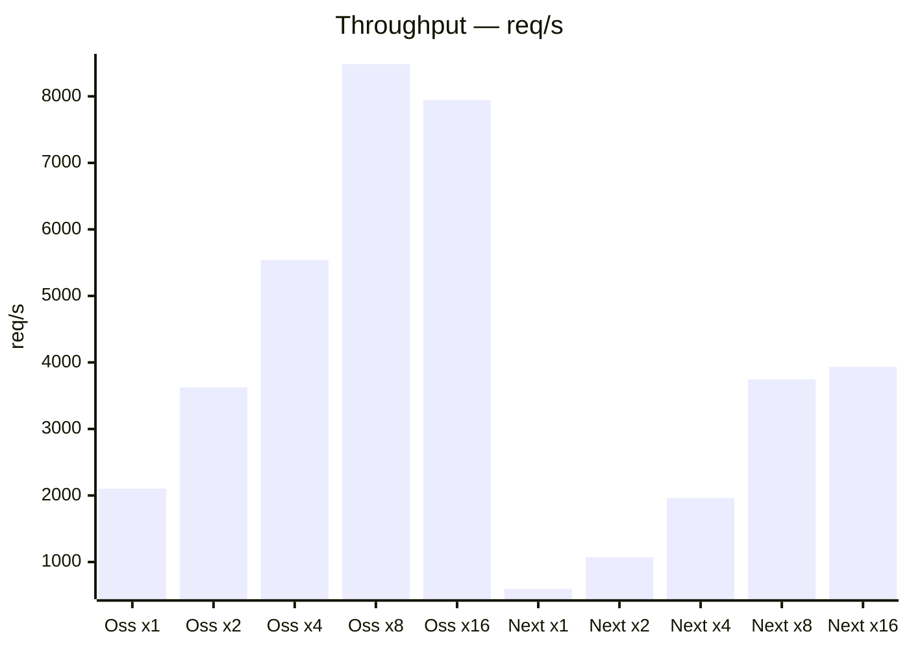
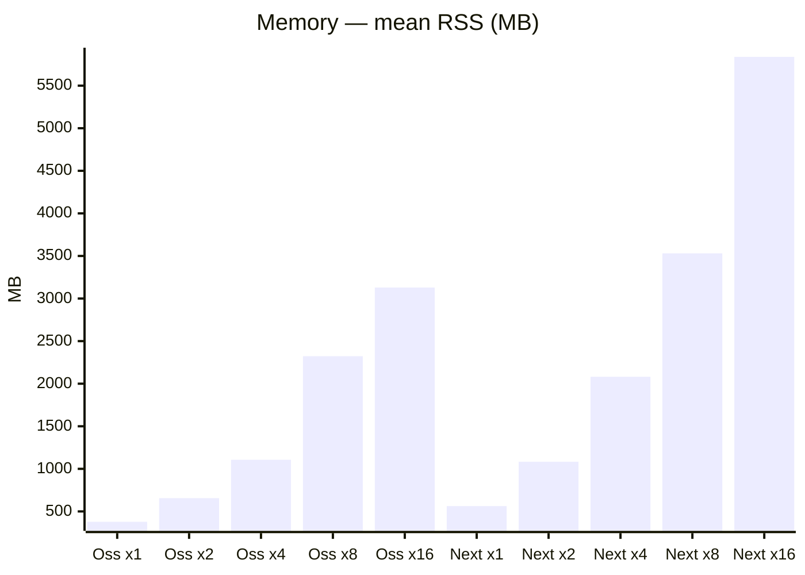
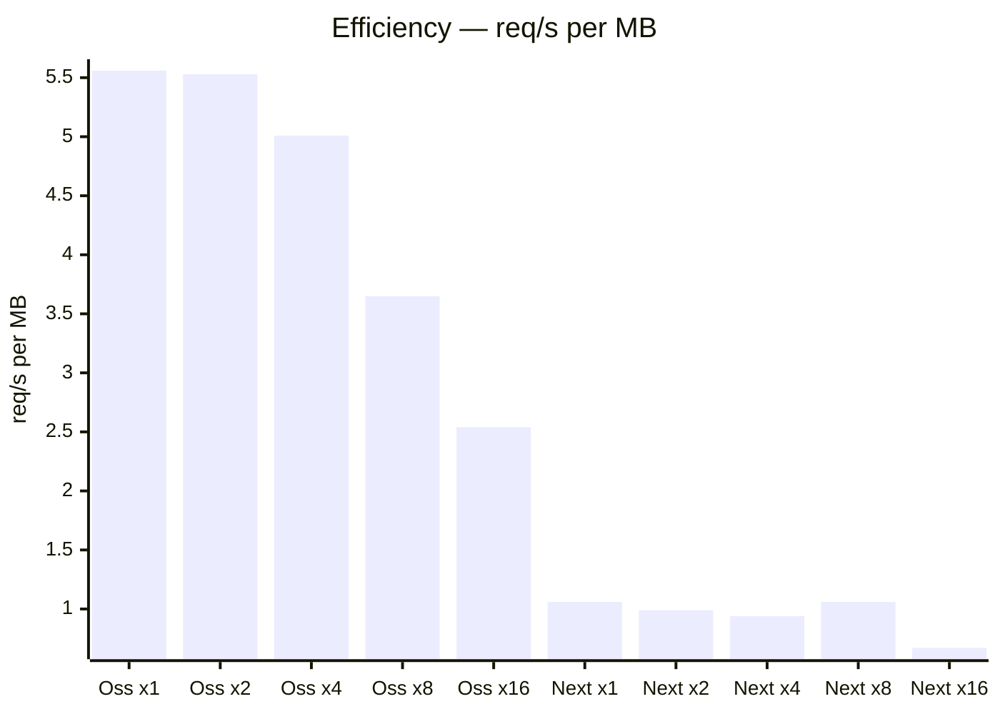

# Ossido vs Next.js — memory efficiency

> Hypothesis: **Ossido serves far more requests per unit of memory.**
>
> Ossido scales SSR across cores with V8 render threads inside a *single*
> Rust process (one shared heap); Next.js scales by forking *N* full Node.js
> processes (one heap each). This sweep runs the same `/ssr` load at each
> parallelism level while sampling the resident memory (RSS) of the whole
> server process group, and reports **req/s per MB**.

## Environment

| | |
| --- | --- |
| Date | 2026-08-22T04:22:27.071Z |
| Host | Darwin 25.5.0 · arm64 |
| CPU | Apple M4 Max |
| Logical cores | 16 |
| Memory | 48.0 GB |
| Load | 50 connections, 10s (+3s warm-up), route `/ssr` |

## Results

| Framework | Parallelism | Idle RSS (MB) | Mean RSS (MB) | Peak RSS (MB) | req/s | **req/s per MB** |
| --- | ---: | ---: | ---: | ---: | ---: | ---: |
| Ossido | 1 | 36 | 378 | 550 | 2,103 | **5.6** |
| Ossido | 2 | 41 | 656 | 932 | 3,625 | **5.5** |
| Ossido | 4 | 52 | 1,106 | 1,570 | 5,540 | **5.0** |
| Ossido | 8 | 69 | 2,323 | 3,510 | 8,484 | **3.7** |
| Ossido | 16 | 109 | 3,129 | 4,560 | 7,942 | **2.5** |
| Next.js | 1 | 117 | 563 | 611 | 595 | **1.1** |
| Next.js | 2 | 293 | 1,083 | 1,172 | 1,073 | **1.0** |
| Next.js | 4 | 509 | 2,081 | 2,215 | 1,963 | **0.9** |
| Next.js | 8 | 942 | 3,531 | 3,719 | 3,744 | **1.1** |
| Next.js | 16 | 1,810 | 5,838 | 6,574 | 3,935 | **0.7** |

## Headline

At full parallelism (16 threads / workers), serving `/ssr`:

- **Ossido:** 7,942 req/s using 3,129 MB → **2.5 req/s per MB**
- **Next.js:** 3,935 req/s using 5,838 MB → **0.7 req/s per MB**

➡️ Ossido is **3.8× more memory-efficient** here, and uses **1.9× less RAM** (3,129 MB vs 5,838 MB) while serving 2.02× the throughput.

**Baseline footprint:** the gap is starkest at idle. Scaling Ossido from 1 to 16 threads adds only **72 MB** (shared process, 109 MB total); scaling Next.js to 16 workers costs **1,810 MB** — **17× more** just to sit idle, because every worker is a full Node.js + Next.js heap.

**Iso-memory:** within Ossido's 3,129 MB footprint, Next.js can only run 4 worker(s) (2,081 MB, 1,963 req/s) — Ossido serves 4.0× the requests in the same RAM.

## Charts

*Bars are the parallelism sweep: `Oss xn` = Ossido with n threads, `Next xn` =
Next.js with n workers.*

### Throughput vs parallelism (req/s — higher is better)

### Memory vs parallelism (mean RSS, MB — lower is better)

### Efficiency vs parallelism (req/s per MB — higher is better)

This is the direct test of the hypothesis.

---

### How this is measured

- **Memory:** RSS of the entire server process group (Ossido: one process
  with N render threads; Next.js: the cluster primary + N workers), summed
  from `ps` and sampled every 250ms during the load. *Idle* is captured just
  before load; *mean*/*peak* are over the load window.
- **Throughput:** [autocannon](https://github.com/mcollina/autocannon) against
  `/ssr` (50 connections, 10s, after warm-up).
- **Parallelism** = `OSSIDO_SSR_THREADS` for Ossido, Node `cluster` worker
  count (`WEB_CONCURRENCY`) for Next.js.
- Both are production builds rendering the identical component tree.
