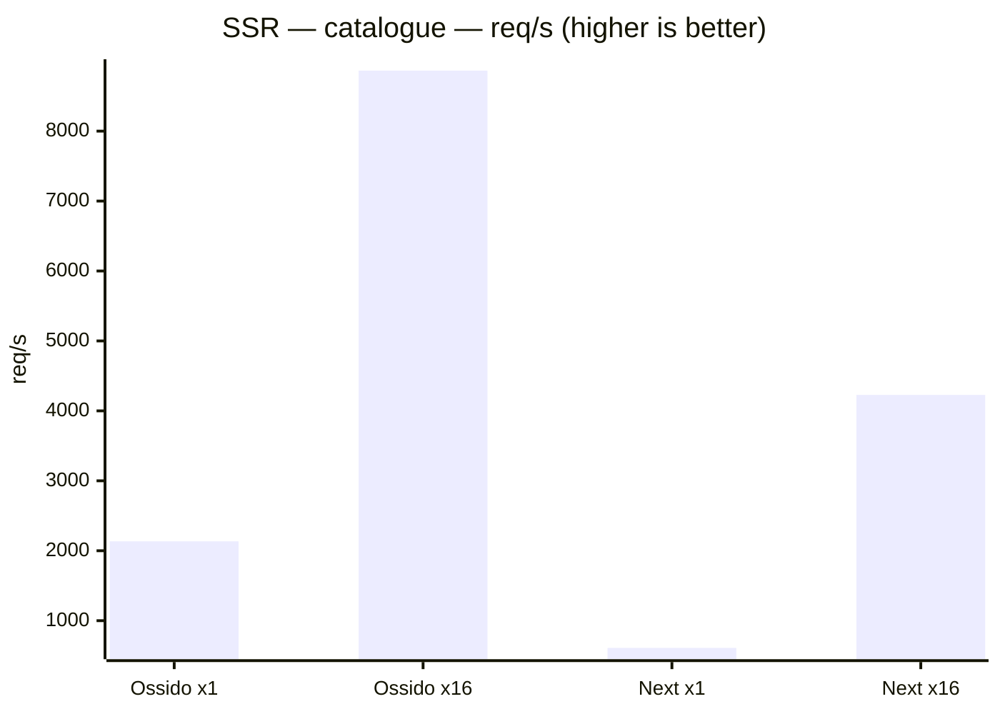
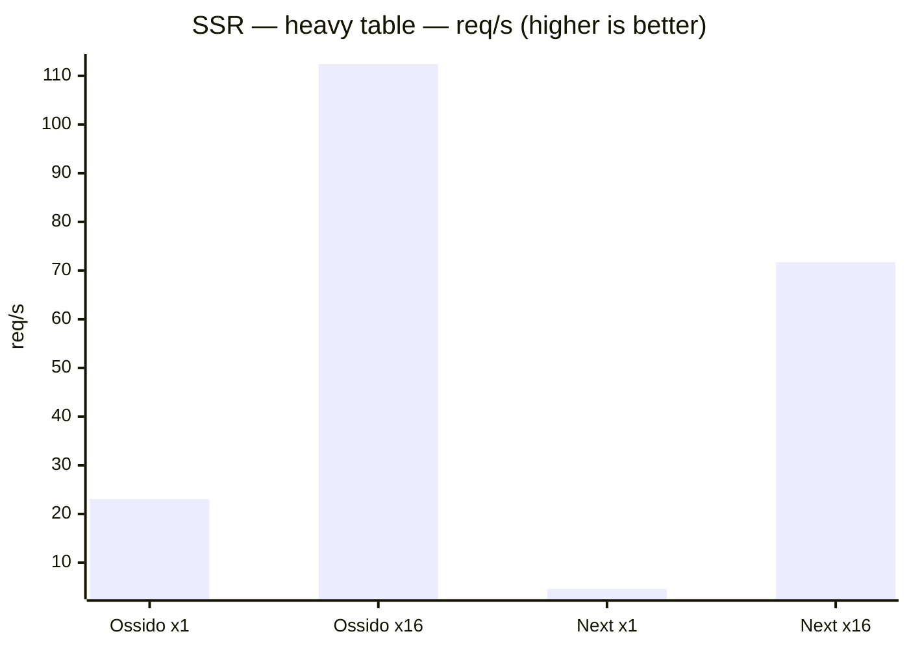
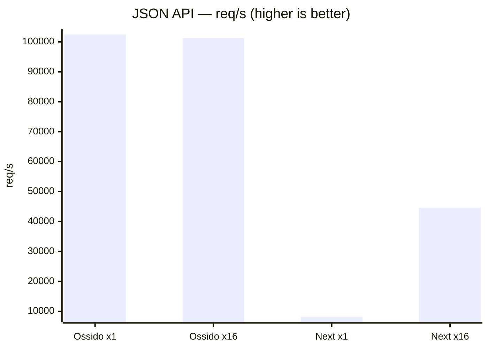
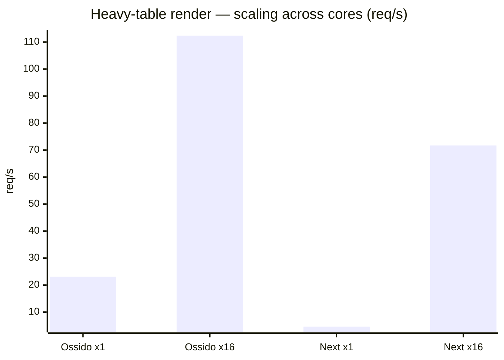
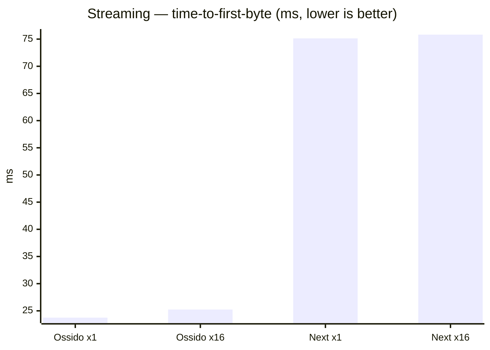

# Ossido vs Next.js — SSR benchmark

> Generated by `bun run bench`. Both apps render **byte-for-byte identical**
> React trees from identical data, so differences reflect the runtime, not the
> workload. Ossido renders through a multi-threaded V8 render pool embedded in a
> Rust/axum server; Next.js runs on Node.js, scaled across cores with the
> `cluster` module. Higher req/s is better; lower latency is better.

## Environment

| | |
| --- | --- |
| Date | 2026-08-22T04:19:50.987Z |
| Host | Darwin 25.5.0 · arm64 |
| CPU | Apple M4 Max |
| Logical cores | 16 |
| Memory | 48 GB |
| Load | 50 connections, 10s per scenario (heavy-table render uses fewer — see per-scenario `Conns` below) |

## Throughput (req/s — higher is better)

| Scenario | Ossido ×1 | Ossido ×16 | Next ×1 | Next ×16 |
| --- | ---: | ---: | ---: | ---: |
| SSR — catalogue | 2,134 | 8,866 | 610 | 4,228 |
| SSR — heavy table | 23 | 112 | 5 | 72 |
| JSON API | 102,458 | 101,235 | 8,209 | 44,579 |

## p99 latency (ms — lower is better)

| Scenario | Ossido ×1 | Ossido ×16 | Next ×1 | Next ×16 |
| --- | ---: | ---: | ---: | ---: |
| SSR — catalogue | 26.0 | 13.0 | 104.0 | 27.0 |
| SSR — heavy table | 2,307.0 | 484.0 | 9,818.0 | 943.0 |
| JSON API | 1.0 | 1.0 | 11.0 | 5.0 |

## Detailed metrics

| Scenario | Config | Conns | req/s | p50 (ms) | p99 (ms) | Throughput (MB/s) | Errors |
| --- | --- | ---: | ---: | ---: | ---: | ---: | ---: |
| SSR — catalogue | Ossido (1 thread) | 50 | 2,134 | 23.00 | 26.00 | 80.5 | 0 |
| SSR — catalogue | Ossido (16 threads) | 50 | 8,866 | 5.00 | 13.00 | 334.6 | 0 |
| SSR — catalogue | Next.js (1 process) | 50 | 610 | 79.00 | 104.00 | 63.9 | 0 |
| SSR — catalogue | Next.js (16 processes) | 50 | 4,228 | 10.00 | 27.00 | 442.7 | 0 |
| SSR — heavy table | Ossido (1 thread) | 32 | 23 | 1,216.00 | 2,307.00 | 63.2 | 0 |
| SSR — heavy table | Ossido (16 threads) | 32 | 112 | 278.00 | 484.00 | 307.7 | 0 |
| SSR — heavy table | Next.js (1 process) | 32 | 5 | 2,327.00 | 9,818.00 | 34.1 | 0 |
| SSR — heavy table | Next.js (16 processes) | 32 | 72 | 429.00 | 943.00 | 531.5 | 0 |
| JSON API | Ossido (1 thread) | 50 | 102,458 | 0.00 | 1.00 | 1,093.9 | 0 |
| JSON API | Ossido (16 threads) | 50 | 101,235 | 0.00 | 1.00 | 1,080.7 | 0 |
| JSON API | Next.js (1 process) | 50 | 8,209 | 5.00 | 11.00 | 87.8 | 0 |
| JSON API | Next.js (16 processes) | 50 | 44,579 | 0.00 | 5.00 | 476.7 | 0 |

## Charts

### SSR — catalogue — throughput

*60 product cards rendered per request.*

### SSR — heavy table — throughput

*5000-row table, CPU-bound render.*

### JSON API — throughput

*100-item JSON payload (Rust vs Node).*

### Multi-core scaling (req/s: 1 → 16 threads)

How each framework scales from single-threaded to all cores on the CPU-bound
heavy-table render.

- **Ossido**: 23 → 112 req/s (**4.87×**)
- **Next.js**: 5 → 72 req/s (**15.59×**)

## Streaming SSR (time-to-first-byte vs full response)

*shell flushed first, 3000-row table streamed after. Lower TTFB means the browser can start painting the
shell sooner while the server streams the rest.*

| Config | TTFB (ms) | Total (ms) | Streamed after shell (ms) |
| --- | ---: | ---: | ---: |
| Ossido (1 thread) | 23.7 | 25.0 | 1.3 |
| Ossido (16 threads) | 25.2 | 27.0 | 1.7 |
| Next.js (1 process) | 75.1 | 89.0 | 13.9 |
| Next.js (16 processes) | 75.8 | 89.5 | 13.6 |

---

### How this is measured

- **Load generator:** [autocannon](https://github.com/mcollina/autocannon)
  (50 connections, 10s per scenario, after a warm-up pass; the CPU-bound heavy-table render uses fewer connections so a saturated queue does not exceed the request timeout).
- **Single-threaded:** Ossido with `OSSIDO_SSR_THREADS=1`; Next.js as a single
  Node process.
- **Multi-threaded:** Ossido with `OSSIDO_SSR_THREADS=16` (one V8 render
  isolate per core); Next.js as a 16-worker `cluster` on one shared port.
- **Streaming** is probed sequentially, timing the first streamed chunk (shell)
  separately from the full response.
- Both apps are production builds (`ossido build` + `cargo build --release`,
  `next build`) and render the identical component tree from `src/bench/`.
