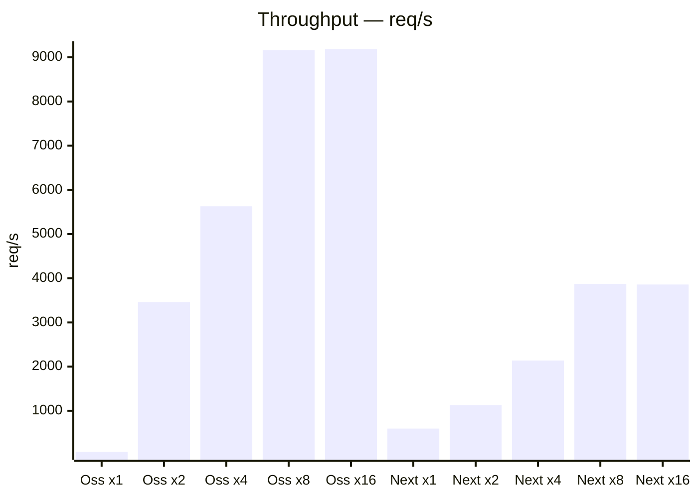
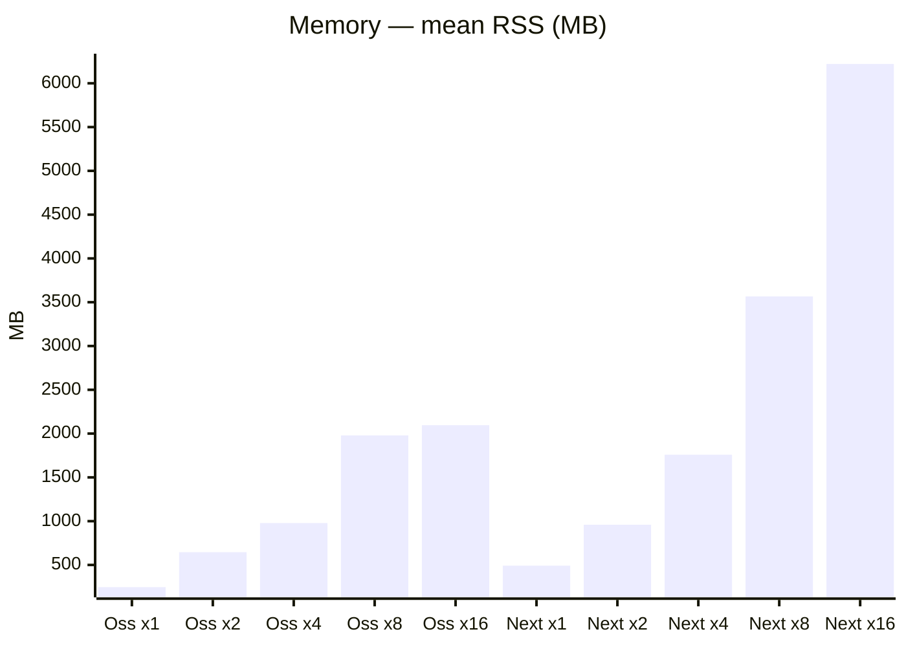
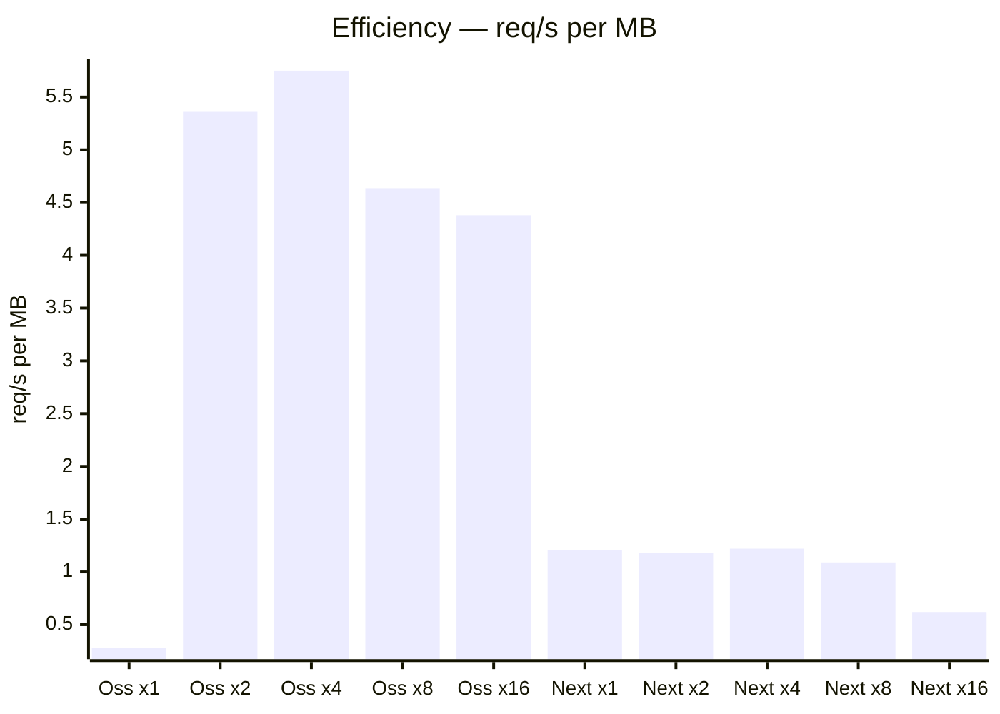

# Ossido vs Next.js — memory efficiency

> Hypothesis: **Ossido serves far more requests per unit of memory.**
>
> Ossido scales SSR across cores with V8 render threads inside a *single*
> Rust process (one shared heap); Next.js scales by forking *N* full Node.js
> processes (one heap each). This sweep runs the same `/ssr` load at each
> parallelism level while sampling the resident memory (RSS) of the whole
> server process group, and reports **req/s per MB**.

## Environment

| | |
| --- | --- |
| Date | 2026-08-22T21:11:20.106953Z |
| Host | Darwin 25.5.0 · aarch64 |
| CPU | Apple M4 Max |
| Logical cores | 16 |
| Memory | 48.0 GB |
| Load | 50 connections, 10s (+3s warm-up), route `/ssr` |

## Results

| Framework | Parallelism | Idle RSS (MB) | Mean RSS (MB) | Peak RSS (MB) | req/s | **req/s per MB** |
| --- | ---: | ---: | ---: | ---: | ---: | ---: |
| Ossido | 1 | 35 | 246 | 268 | 69 | **0.3** |
| Ossido | 2 | 41 | 646 | 946 | 3,458 | **5.4** |
| Ossido | 4 | 49 | 978 | 1,587 | 5,628 | **5.8** |
| Ossido | 8 | 68 | 1,979 | 2,751 | 9,161 | **4.6** |
| Ossido | 16 | 110 | 2,095 | 4,053 | 9,183 | **4.4** |
| Next.js | 1 | 117 | 492 | 518 | 597 | **1.2** |
| Next.js | 2 | 294 | 959 | 1,034 | 1,129 | **1.2** |
| Next.js | 4 | 511 | 1,759 | 1,862 | 2,138 | **1.2** |
| Next.js | 8 | 942 | 3,566 | 3,758 | 3,871 | **1.1** |
| Next.js | 16 | 1,812 | 6,221 | 6,923 | 3,858 | **0.6** |

## Headline

At full parallelism (16 threads / workers), serving `/ssr`:

- **Ossido:** 9,183 req/s using 2,095 MB → **4.4 req/s per MB**
- **Next.js:** 3,858 req/s using 6,221 MB → **0.6 req/s per MB**

➡️ Ossido is **7.1× more memory-efficient** here, and uses **3.0× less RAM** (2,095 MB vs 6,221 MB) while serving 2.38× the throughput.

**Baseline footprint:** the gap is starkest at idle. Scaling Ossido from 1 to 16 threads adds only **75 MB** (shared process, 110 MB total); scaling Next.js to 16 workers costs **1,812 MB** — **16× more** just to sit idle, because every worker is a full Node.js + Next.js heap.

**Iso-memory:** within Ossido's 2,095 MB footprint, Next.js can only run 4 worker(s) (1,759 MB, 2,138 req/s) — Ossido serves 4.3× the requests in the same RAM.

## Charts

*Bars are the parallelism sweep: `Oss xn` = Ossido with n threads, `Next xn` =
Next.js with n workers.*

### Throughput vs parallelism (req/s — higher is better)

### Memory vs parallelism (mean RSS, MB — lower is better)

### Efficiency vs parallelism (req/s per MB — higher is better)

This is the direct test of the hypothesis.

---

### How this is measured

- **Memory:** RSS of the entire server process group (Ossido: one process
  with N render threads; Next.js: the cluster primary + N workers), summed
  and sampled every 250ms during the load. *Idle* is captured just
  before load; *mean*/*peak* are over the load window.
- **Throughput:** a built-in Rust/tokio load generator against
  `/ssr` (50 connections, 10s, after warm-up).
- **Parallelism** = `OSSIDO_SSR_THREADS` for Ossido, Node `cluster` worker
  count (`WEB_CONCURRENCY`) for Next.js.
- Both are production builds rendering the identical component tree.
