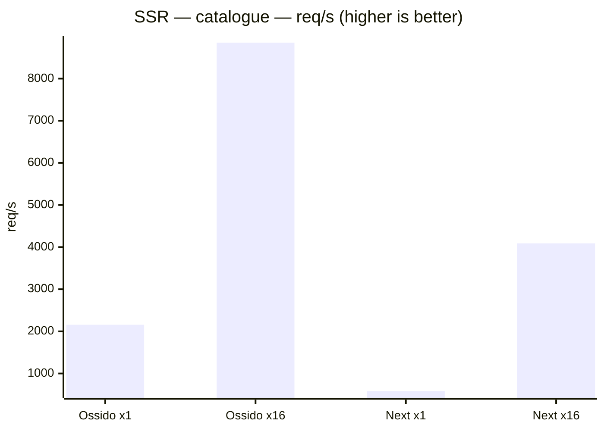
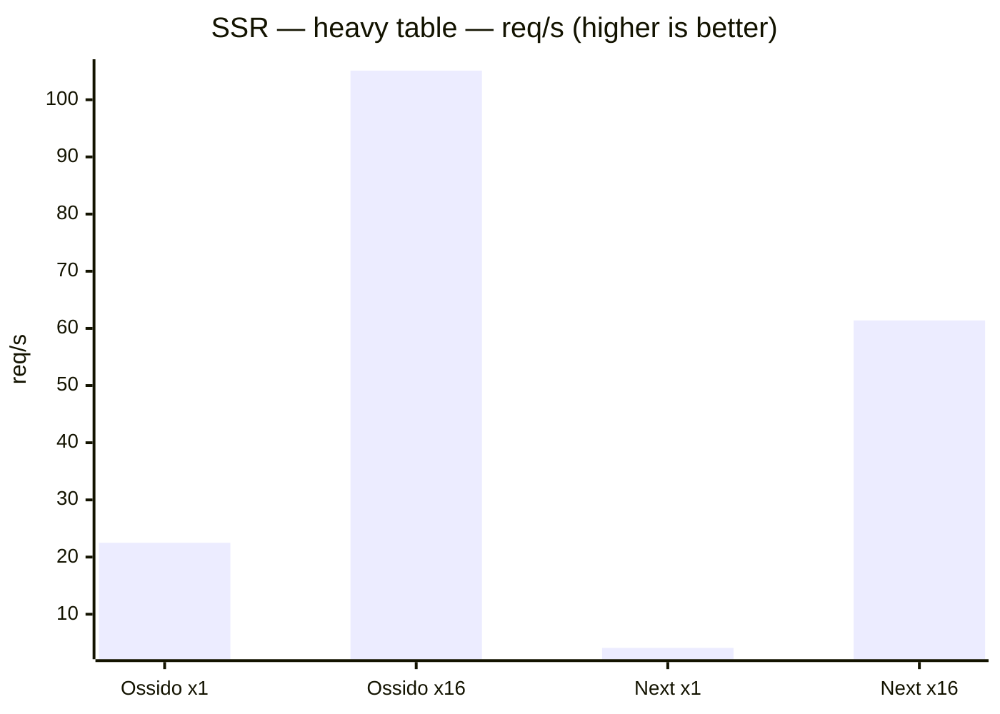
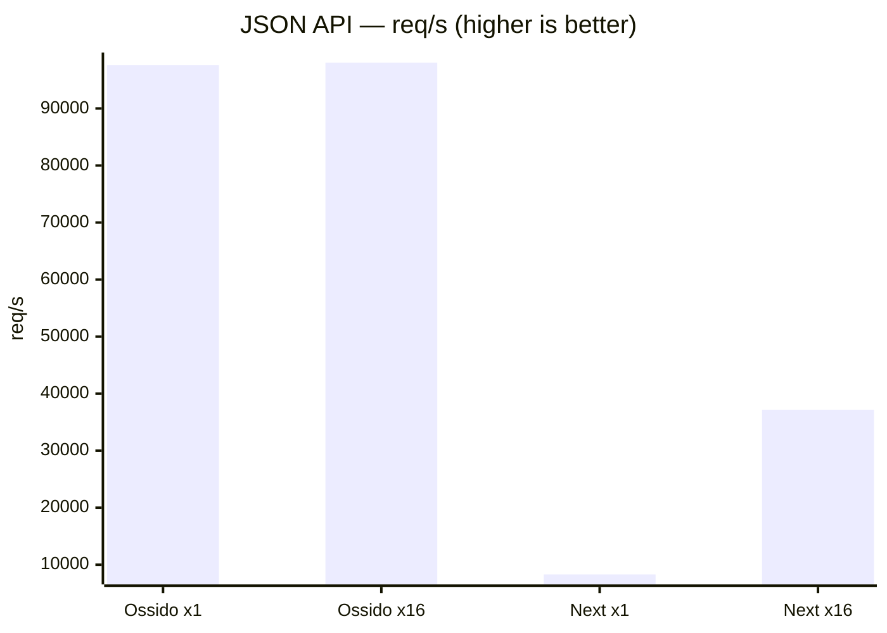
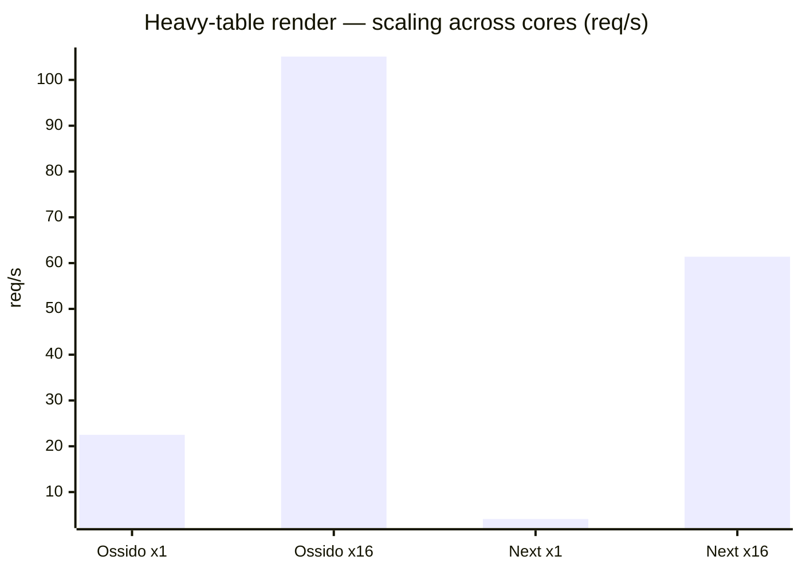
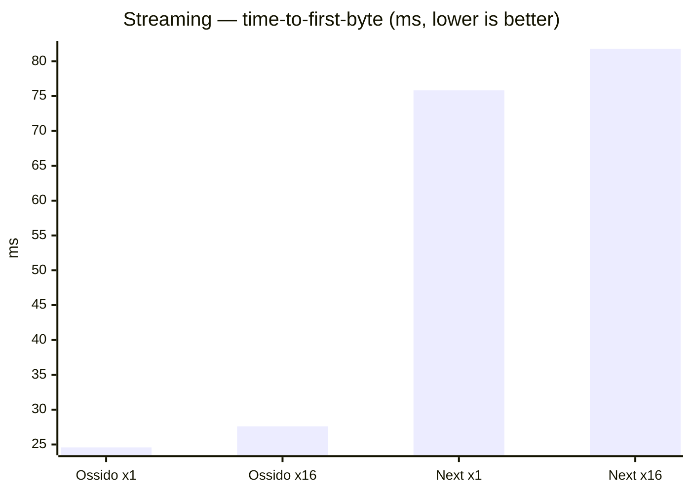

# Ossido vs Next.js — SSR benchmark

> Generated by `bun run bench`. Both apps render **byte-for-byte identical**
> React trees from identical data, so differences reflect the runtime, not the
> workload. Ossido renders through a multi-threaded V8 render pool embedded in a
> Rust/axum server; Next.js runs on Node.js, scaled across cores with the
> `cluster` module. Higher req/s is better; lower latency is better.

## Environment

| | |
| --- | --- |
| Date | 2026-08-22T15:01:57.051Z |
| Host | Darwin 25.5.0 · arm64 |
| CPU | Apple M4 Max |
| Logical cores | 16 |
| Memory | 48 GB |
| Versions | Ossido 0.1.8-beta.20260822040659Z, Next.js 16.3.2 |
| Load | 50 connections, 10s per scenario (heavy-table render uses fewer — see per-scenario `Conns` below) |

## Throughput (req/s — higher is better)

| Scenario | Ossido ×1 | Ossido ×16 | Next ×1 | Next ×16 |
| --- | ---: | ---: | ---: | ---: |
| SSR — catalogue | 2,157 | 8,855 | 581 | 4,090 |
| SSR — heavy table | 23 | 105 | 4 | 61 |
| JSON API | 97,574 | 98,048 | 8,298 | 37,142 |

## p99 latency (ms — lower is better)

| Scenario | Ossido ×1 | Ossido ×16 | Next ×1 | Next ×16 |
| --- | ---: | ---: | ---: | ---: |
| SSR — catalogue | 25.0 | 13.0 | 102.0 | 44.0 |
| SSR — heavy table | 2,351.0 | 459.0 | 9,352.0 | 1,190.0 |
| JSON API | 1.0 | 1.0 | 11.0 | 6.0 |

## Detailed metrics

| Scenario | Config | Conns | req/s | p50 (ms) | p99 (ms) | Throughput (MB/s) | Errors |
| --- | --- | ---: | ---: | ---: | ---: | ---: | ---: |
| SSR — catalogue | Ossido (1 thread) | 50 | 2,157 | 22.00 | 25.00 | 81.4 | 0 |
| SSR — catalogue | Ossido (16 threads) | 50 | 8,855 | 5.00 | 13.00 | 334.1 | 0 |
| SSR — catalogue | Next.js (1 process) | 50 | 581 | 84.00 | 102.00 | 60.9 | 0 |
| SSR — catalogue | Next.js (16 processes) | 50 | 4,090 | 8.00 | 44.00 | 428.3 | 0 |
| SSR — heavy table | Ossido (1 thread) | 32 | 23 | 1,250.00 | 2,351.00 | 61.6 | 0 |
| SSR — heavy table | Ossido (16 threads) | 32 | 105 | 294.00 | 459.00 | 287.7 | 0 |
| SSR — heavy table | Next.js (1 process) | 32 | 4 | 2,387.00 | 9,352.00 | 30.4 | 0 |
| SSR — heavy table | Next.js (16 processes) | 32 | 61 | 489.00 | 1,190.00 | 455.2 | 0 |
| JSON API | Ossido (1 thread) | 50 | 97,574 | 0.00 | 1.00 | 1,042.0 | 0 |
| JSON API | Ossido (16 threads) | 50 | 98,048 | 0.00 | 1.00 | 1,046.7 | 0 |
| JSON API | Next.js (1 process) | 50 | 8,298 | 5.00 | 11.00 | 88.7 | 0 |
| JSON API | Next.js (16 processes) | 50 | 37,142 | 0.00 | 6.00 | 397.2 | 0 |

## Charts

### SSR — catalogue — throughput

*60 product cards rendered per request.*

### SSR — heavy table — throughput

*5000-row table, CPU-bound render.*

### JSON API — throughput

*100-item JSON payload (Rust vs Node).*

### Multi-core scaling (req/s: 1 → 16 threads)

How each framework scales from single-threaded to all cores on the CPU-bound
heavy-table render.

- **Ossido**: 23 → 105 req/s (**4.67×**)
- **Next.js**: 4 → 61 req/s (**14.98×**)

## Streaming SSR (time-to-first-byte vs full response)

*shell flushed first, 3000-row table streamed after. Lower TTFB means the browser can start painting the
shell sooner while the server streams the rest.*

| Config | TTFB (ms) | Total (ms) | Streamed after shell (ms) |
| --- | ---: | ---: | ---: |
| Ossido (1 thread) | 24.6 | 26.2 | 1.6 |
| Ossido (16 threads) | 27.6 | 29.4 | 1.8 |
| Next.js (1 process) | 75.8 | 89.7 | 13.8 |
| Next.js (16 processes) | 81.8 | 96.3 | 14.5 |

---

### How this is measured

- **Load generator:** [autocannon](https://github.com/mcollina/autocannon)
  (50 connections, 10s per scenario, after a warm-up pass; the CPU-bound heavy-table render uses fewer connections so a saturated queue does not exceed the request timeout).
- **Single-threaded:** Ossido with `OSSIDO_SSR_THREADS=1`; Next.js as a single
  Node process.
- **Multi-threaded:** Ossido with `OSSIDO_SSR_THREADS=16` (one V8 render
  isolate per core); Next.js as a 16-worker `cluster` on one shared port.
- **Streaming** is probed sequentially, timing the first streamed chunk (shell)
  separately from the full response.
- Both apps are production builds (`ossido build` + `cargo build --release`,
  `next build`) and render the identical component tree from `src/bench/`.
