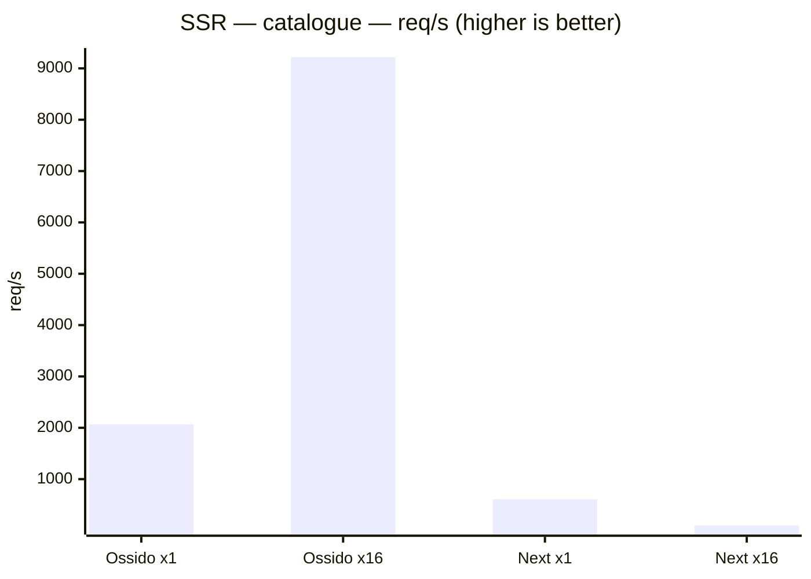
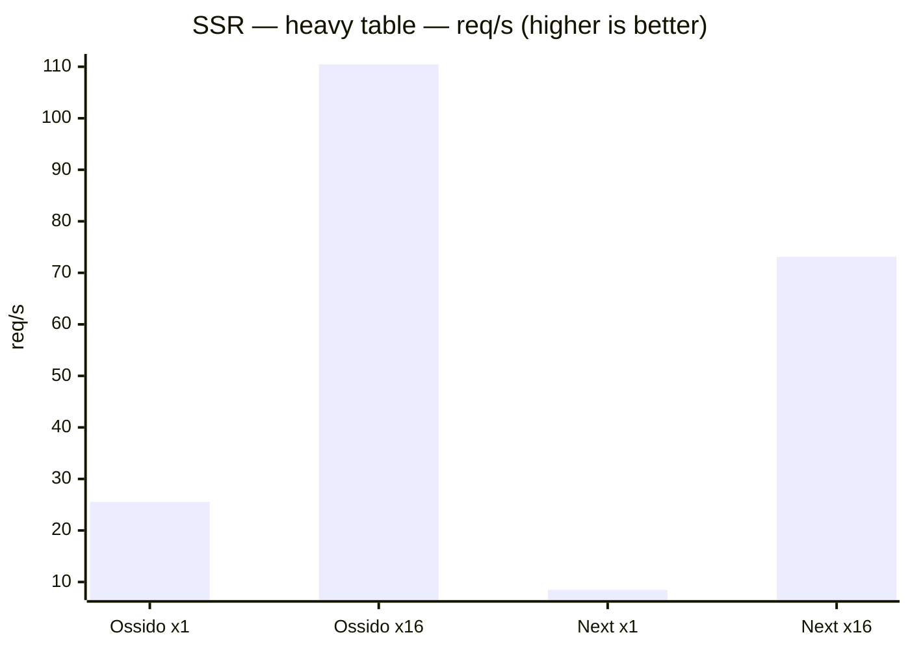
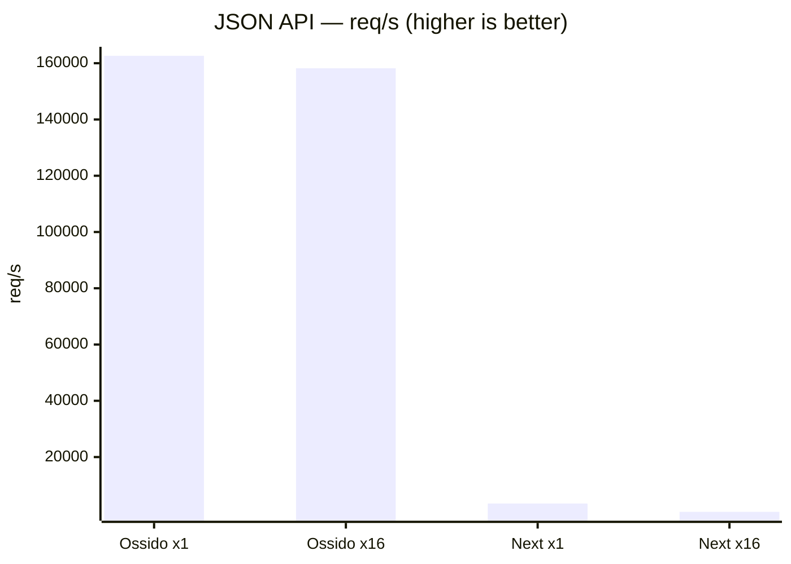
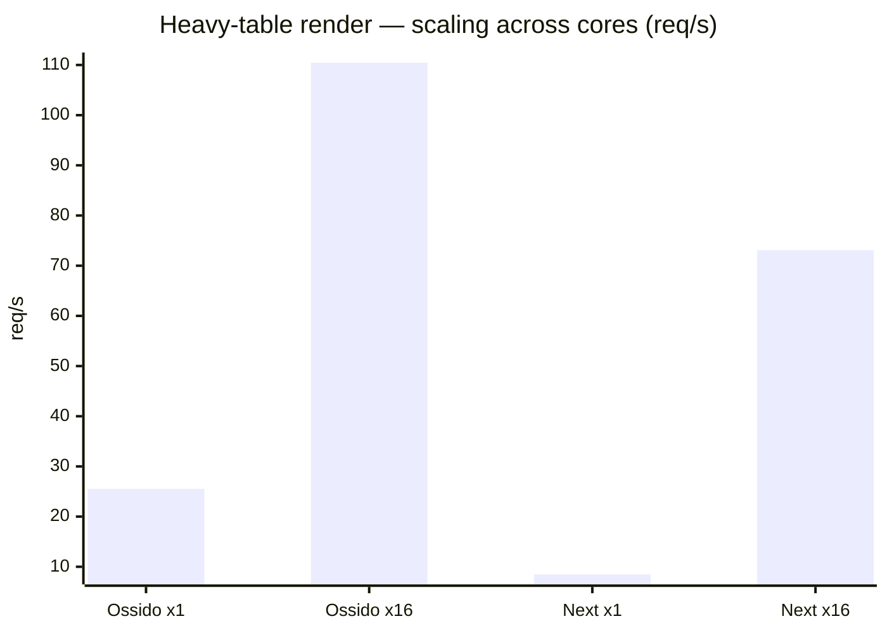
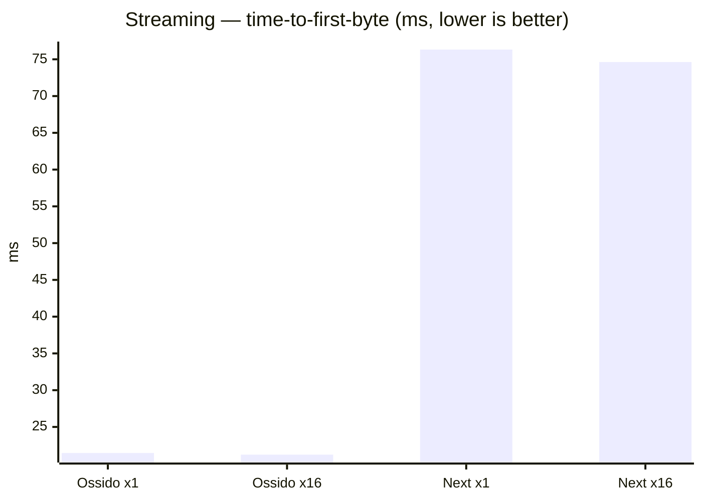

# Ossido vs Next.js — SSR benchmark

> Generated by `bun run bench`. Both apps render **byte-for-byte identical**
> React trees from identical data, so differences reflect the runtime, not the
> workload. Ossido renders through a multi-threaded V8 render pool embedded in a
> Rust/axum server; Next.js runs on Node.js, scaled across cores with the
> `cluster` module. Higher req/s is better; lower latency is better.

## Environment

| | |
| --- | --- |
| Date | 2026-08-23T02:06:57.697118Z |
| Host | Darwin 25.5.0 · aarch64 |
| CPU | Apple M4 Max |
| Logical cores | 16 |
| Memory | 48 GB |
| Versions | Ossido 0.1.8-beta.20260823015357Z, Next.js 16.3.2 |
| Load | 50 connections, 10s per scenario (heavy-table render uses fewer — see per-scenario `Conns` below) |

## Throughput (req/s — higher is better)

| Scenario | Ossido ×1 | Ossido ×16 | Next ×1 | Next ×16 |
| --- | ---: | ---: | ---: | ---: |
| SSR — catalogue | 2,067 | 9,217 | 607 | 98 |
| SSR — heavy table | 26 | 110 | 8 | 73 |
| JSON API | 162,653 | 158,222 | 3,476 | 528 |

## p99 latency (ms — lower is better)

| Scenario | Ossido ×1 | Ossido ×16 | Next ×1 | Next ×16 |
| --- | ---: | ---: | ---: | ---: |
| SSR — catalogue | 25.8 | 14.0 | 99.5 | 398.1 |
| SSR — heavy table | 1,297.4 | 394.8 | 11,337.7 | 658.9 |
| JSON API | 0.7 | 0.8 | 28.5 | 48.1 |

## Detailed metrics

| Scenario | Config | Conns | req/s | p50 (ms) | p99 (ms) | Throughput (MB/s) | Errors |
| --- | --- | ---: | ---: | ---: | ---: | ---: | ---: |
| SSR — catalogue | Ossido (1 thread) | 50 | 2,067 | 24.09 | 25.79 | 77.2 | 0 |
| SSR — catalogue | Ossido (16 threads) | 50 | 9,217 | 4.98 | 14.01 | 344.3 | 0 |
| SSR — catalogue | Next.js (1 process) | 50 | 607 | 80.77 | 99.45 | 63.4 | 0 |
| SSR — catalogue | Next.js (16 processes) | 50 | 98 | 16.50 | 398.08 | 10.2 | 50376 |
| SSR — heavy table | Ossido (1 thread) | 32 | 26 | 1,244.16 | 1,297.41 | 69.6 | 0 |
| SSR — heavy table | Ossido (16 threads) | 32 | 110 | 286.72 | 394.75 | 301.3 | 0 |
| SSR — heavy table | Next.js (1 process) | 32 | 8 | 2,689.02 | 11,337.73 | 62.8 | 0 |
| SSR — heavy table | Next.js (16 processes) | 32 | 73 | 431.36 | 658.94 | 541.9 | 0 |
| JSON API | Ossido (1 thread) | 50 | 162,653 | 0.29 | 0.74 | 1,699.0 | 0 |
| JSON API | Ossido (16 threads) | 50 | 158,222 | 0.30 | 0.78 | 1,652.7 | 0 |
| JSON API | Next.js (1 process) | 50 | 3,476 | 0.95 | 28.46 | 36.3 | 24378 |
| JSON API | Next.js (16 processes) | 50 | 528 | 1.12 | 48.13 | 5.5 | 49427 |

## Charts

### SSR — catalogue — throughput

*60 product cards rendered per request.*

### SSR — heavy table — throughput

*5000-row table, CPU-bound render.*

### JSON API — throughput

*100-item JSON payload (Rust vs Node).*

### Multi-core scaling (req/s: 1 → 16 threads)

How each framework scales from single-threaded to all cores on the CPU-bound
heavy-table render.

- **Ossido**: 26 → 110 req/s (**4.33×**)
- **Next.js**: 8 → 73 req/s (**8.63×**)

## Streaming SSR (time-to-first-byte vs full response)

*shell flushed first, 3000-row table streamed after. Lower TTFB means the browser can start painting the
shell sooner while the server streams the rest.*

| Config | TTFB (ms) | Total (ms) | Streamed after shell (ms) |
| --- | ---: | ---: | ---: |
| Ossido (1 thread) | 21.4 | 28.7 | 7.2 |
| Ossido (16 threads) | 21.2 | 28.9 | 7.7 |
| Next.js (1 process) | 76.3 | 77.4 | 1.1 |
| Next.js (16 processes) | 74.6 | 75.5 | 0.8 |

---

### How this is measured

- **Load generator:** a built-in Rust/tokio load generator
  (50 connections, 10s per scenario, after a warm-up pass; the CPU-bound heavy-table render uses fewer connections so a saturated queue does not exceed the request timeout).
- **Single-threaded:** Ossido with `OSSIDO_SSR_THREADS=1`; Next.js as a single
  Node process.
- **Multi-threaded:** Ossido with `OSSIDO_SSR_THREADS=16` (one V8 render
  isolate per core); Next.js as a 16-worker `cluster` on one shared port.
- **Streaming** is probed sequentially, timing the first streamed chunk (shell)
  separately from the full response.
- Both apps are production builds (`ossido build` + `cargo build --release`,
  `next build`) and render the identical component tree from `src/bench/`.
