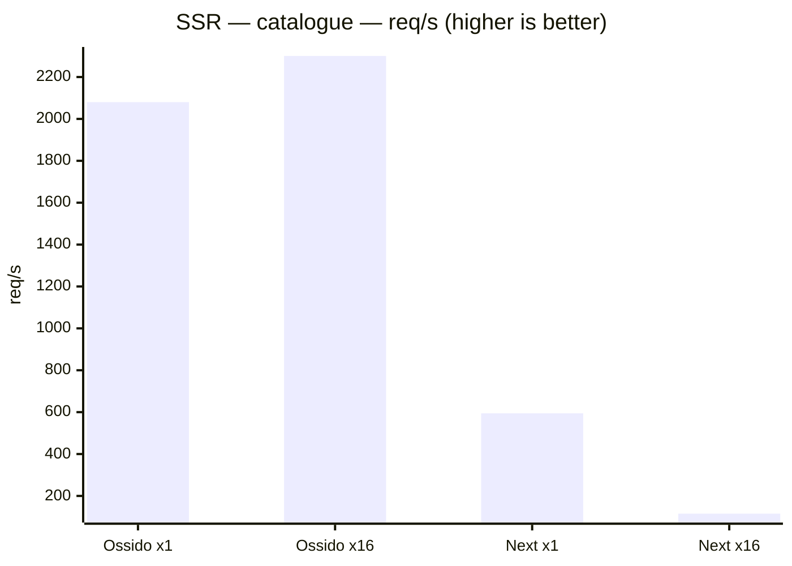
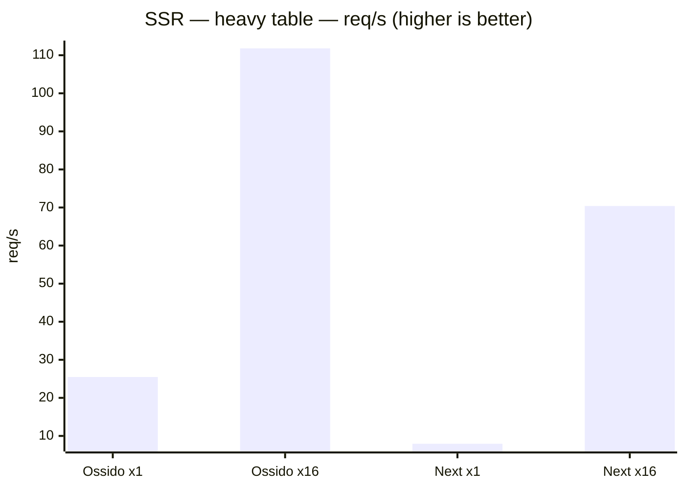
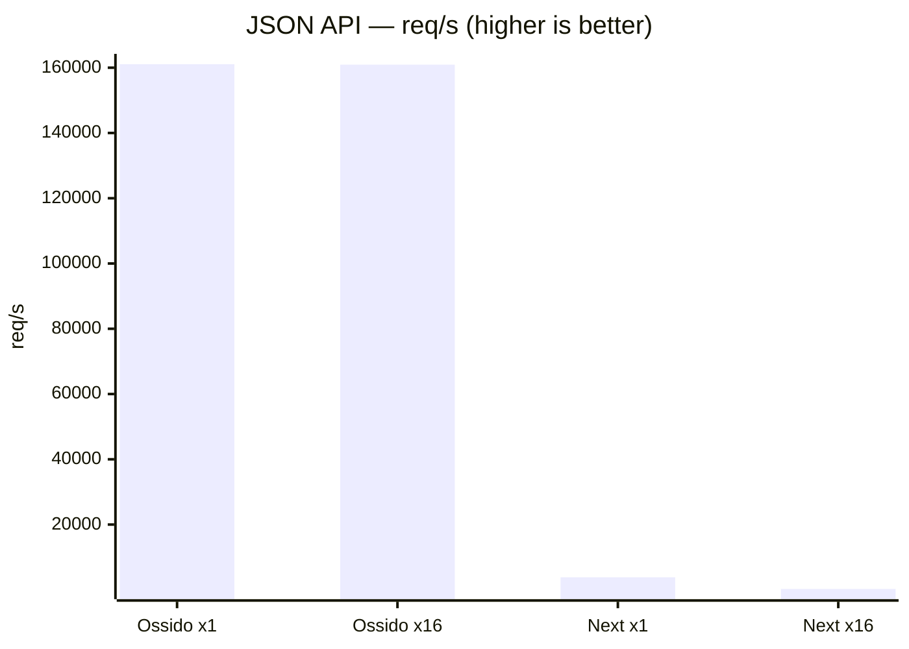
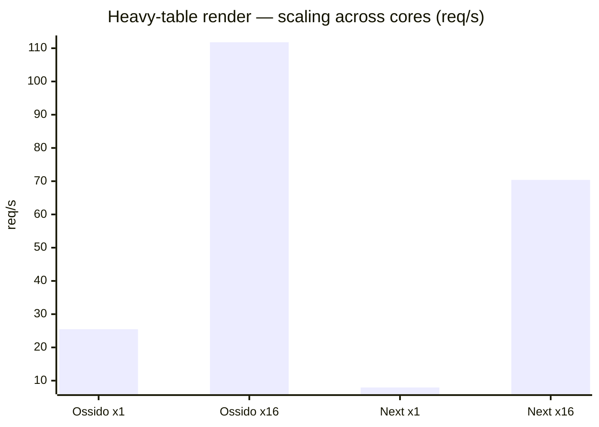
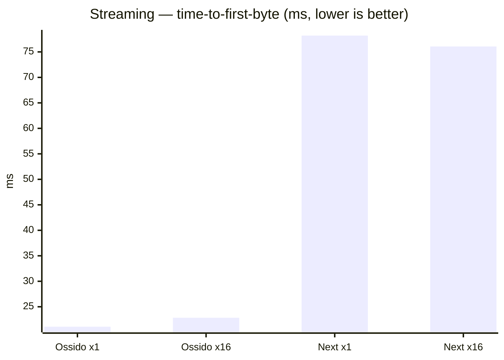

# Ossido vs Next.js — SSR benchmark

> Generated by `bun run bench`. Both apps render **byte-for-byte identical**
> React trees from identical data, so differences reflect the runtime, not the
> workload. Ossido renders through a multi-threaded V8 render pool embedded in a
> Rust/axum server; Next.js runs on Node.js, scaled across cores with the
> `cluster` module. Higher req/s is better; lower latency is better.

## Environment

| | |
| --- | --- |
| Date | 2026-08-23T02:26:40.477432Z |
| Host | Darwin 25.5.0 · aarch64 |
| CPU | Apple M4 Max |
| Logical cores | 16 |
| Memory | 48 GB |
| Versions | Ossido 0.1.8, Next.js 16.3.2 |
| Load | 50 connections, 10s per scenario (heavy-table render uses fewer — see per-scenario `Conns` below) |

## Throughput (req/s — higher is better)

| Scenario | Ossido ×1 | Ossido ×16 | Next ×1 | Next ×16 |
| --- | ---: | ---: | ---: | ---: |
| SSR — catalogue | 2,080 | 2,301 | 594 | 115 |
| SSR — heavy table | 25 | 112 | 8 | 70 |
| JSON API | 161,086 | 160,929 | 3,835 | 262 |

## p99 latency (ms — lower is better)

| Scenario | Ossido ×1 | Ossido ×16 | Next ×1 | Next ×16 |
| --- | ---: | ---: | ---: | ---: |
| SSR — catalogue | 26.0 | 13.6 | 101.4 | 67.5 |
| SSR — heavy table | 1,303.6 | 356.4 | 11,583.5 | 673.8 |
| JSON API | 0.8 | 0.8 | 33.1 | 238.5 |

## Detailed metrics

| Scenario | Config | Conns | req/s | p50 (ms) | p99 (ms) | Throughput (MB/s) | Errors |
| --- | --- | ---: | ---: | ---: | ---: | ---: | ---: |
| SSR — catalogue | Ossido (1 thread) | 50 | 2,080 | 23.95 | 25.95 | 77.7 | 0 |
| SSR — catalogue | Ossido (16 threads) | 50 | 2,301 | 4.97 | 13.65 | 85.9 | 2 |
| SSR — catalogue | Next.js (1 process) | 50 | 594 | 82.75 | 101.44 | 62.0 | 0 |
| SSR — catalogue | Next.js (16 processes) | 50 | 115 | 16.51 | 67.52 | 12.0 | 46763 |
| SSR — heavy table | Ossido (1 thread) | 32 | 25 | 1,243.13 | 1,303.55 | 69.5 | 0 |
| SSR — heavy table | Ossido (16 threads) | 32 | 112 | 285.18 | 356.35 | 305.0 | 0 |
| SSR — heavy table | Next.js (1 process) | 32 | 8 | 2,736.13 | 11,583.49 | 58.9 | 0 |
| SSR — heavy table | Next.js (16 processes) | 32 | 70 | 446.98 | 673.79 | 521.8 | 0 |
| JSON API | Ossido (1 thread) | 50 | 161,086 | 0.29 | 0.75 | 1,682.6 | 0 |
| JSON API | Ossido (16 threads) | 50 | 160,929 | 0.29 | 0.76 | 1,681.0 | 0 |
| JSON API | Next.js (1 process) | 50 | 3,835 | 1.05 | 33.05 | 40.0 | 17682 |
| JSON API | Next.js (16 processes) | 50 | 262 | 1.03 | 238.46 | 2.7 | 47835 |

## Charts

### SSR — catalogue — throughput

*60 product cards rendered per request.*

### SSR — heavy table — throughput

*5000-row table, CPU-bound render.*

### JSON API — throughput

*100-item JSON payload (Rust vs Node).*

### Multi-core scaling (req/s: 1 → 16 threads)

How each framework scales from single-threaded to all cores on the CPU-bound
heavy-table render.

- **Ossido**: 25 → 112 req/s (**4.39×**)
- **Next.js**: 8 → 70 req/s (**8.86×**)

## Streaming SSR (time-to-first-byte vs full response)

*shell flushed first, 3000-row table streamed after. Lower TTFB means the browser can start painting the
shell sooner while the server streams the rest.*

| Config | TTFB (ms) | Total (ms) | Streamed after shell (ms) |
| --- | ---: | ---: | ---: |
| Ossido (1 thread) | 21.1 | 28.5 | 7.4 |
| Ossido (16 threads) | 22.8 | 30.3 | 7.4 |
| Next.js (1 process) | 78.2 | 79.2 | 1.0 |
| Next.js (16 processes) | 76.1 | 77.1 | 1.0 |

---

### How this is measured

- **Load generator:** a built-in Rust/tokio load generator
  (50 connections, 10s per scenario, after a warm-up pass; the CPU-bound heavy-table render uses fewer connections so a saturated queue does not exceed the request timeout).
- **Single-threaded:** Ossido with `OSSIDO_SSR_THREADS=1`; Next.js as a single
  Node process.
- **Multi-threaded:** Ossido with `OSSIDO_SSR_THREADS=16` (one V8 render
  isolate per core); Next.js as a 16-worker `cluster` on one shared port.
- **Streaming** is probed sequentially, timing the first streamed chunk (shell)
  separately from the full response.
- Both apps are production builds (`ossido build` + `cargo build --release`,
  `next build`) and render the identical component tree from `src/bench/`.
